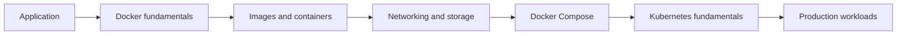

# Docker & Kubernetes Learning Journey

A practical, beginner-to-deep learning journey focused on Docker, Kubernetes, and real-world Java/Spring Boot workloads.

The notes are written mainly in **Bangla**, while commands, code, and technical terminology remain in English so that the material stays useful for hands-on practice and interview preparation.

## Learning path



## Repository map

```text
docker-kubernetes-learning-journey/
├── README.md
├── ROADMAP.md
├── docker/
│   ├── README.md
│   └── 01-docker-container-fundamentals/
│       ├── README.md
│       └── spring-boot-example/
└── kubernetes/
    └── README.md
```

Each numbered topic is self-contained:

- `README.md` — concept, diagrams, commands, and interview notes;
- example directory — runnable code related to that topic;
- numbering — recommended learning order.

## Current content

### Docker

1. [Docker ও Container: সমস্যাটা আসলে কোথায়?](docker/01-docker-container-fundamentals/README.md) — ✅ Complete

### Kubernetes

The Kubernetes journey will begin after completing the Docker foundation. See the [Kubernetes index](kubernetes/README.md).

## Quick start

Clone the repository:

```bash
git clone https://github.com/rhidoyhasanmahmud/docker-kubernetes-learning-journey.git
cd docker-kubernetes-learning-journey
```

Run the first Spring Boot container example:

```bash
cd docker/01-docker-container-fundamentals/spring-boot-example
docker build -t docker-intro-api:1.0 .
docker run --name docker-intro-api \
  --memory=256m \
  --cpus=1 \
  -p 8080:8080 \
  docker-intro-api:1.0
```

Then open `http://localhost:8080/api/environment` or run:

```bash
curl http://localhost:8080/api/environment
```

## Progress

The detailed topic checklist and publication status are maintained in [ROADMAP.md](ROADMAP.md).

## Author

**Hasan Mahmud Rhidoy** — Senior Software Engineer working with Java, Spring Boot, AWS, and distributed systems.

## Feedback

If you find an error or have a suggestion, please open an issue. The repository is maintained as a learning journal, so explanations and examples will continue to improve over time.
