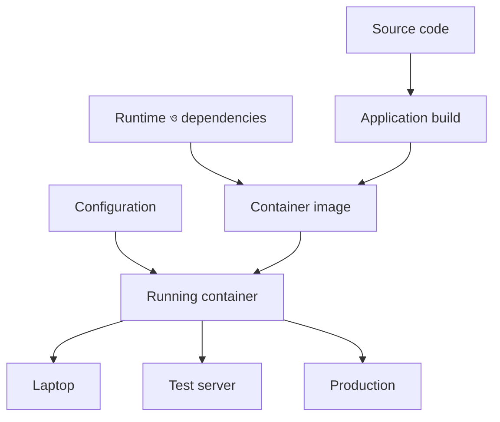
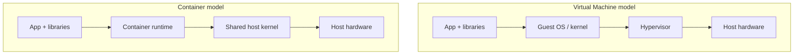
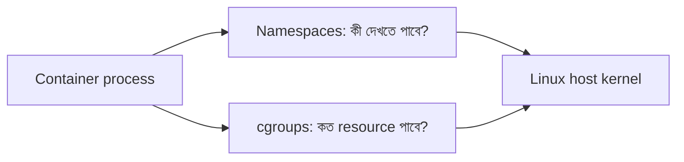

# Docker ও Container: সমস্যাটা আসলে কোথায়?

> **Learning outcome:** এই লেখা শেষ করার পর Container কেন দরকার, Virtual Machine থেকে এটি কীভাবে আলাদা, এবং Docker কীভাবে একটি Spring Boot application-এর environment consistent রাখে—নিজের ভাষায় ব্যাখ্যা করতে পারবেন।

## শুরুটা Docker দিয়ে নয়, সমস্যা দিয়ে

ধরুন, আমি একটি Spring Boot application তৈরি করেছি। আমার laptop-এ application ঠিকভাবে চলছে। কিন্তু একই code যখন সহকর্মীর machine, test server বা production server-এ চালানো হলো, তখন আর কাজ করছে না। পরিচিত উত্তরটি হলো:

> “কিন্তু আমার machine-এ তো ঠিকই চলে!”

এই সমস্যার কারণ সাধারণত application code নয়; বরং application-এর চারপাশের environment-এর পার্থক্য। যেমন:

- আমার machine-এ Java 21, server-এ Java 17;
- প্রয়োজনীয় OS package বা native library অনুপস্থিত;
- environment variable-এর নাম বা value আলাদা;
- file path, timezone, locale বা permission আলাদা;
- dependency বা configuration-এর version mismatch;
- একই server-এ অন্য application-এর সঙ্গে port বা resource conflict।

শুধু `.jar` file পাঠালে আমরা application পাঠাই, কিন্তু application যে environment-এর ওপর নির্ভর করে সেটি পুরোপুরি পাঠাই না। Docker মূলত এই জায়গাটিতেই সাহায্য করে।



একই image বিভিন্ন environment-এ চালানোর ফলে application binary, runtime এবং প্রয়োজনীয় system dependency consistent থাকে। Environment-specific configuration image-এর বাইরে environment variable বা secret হিসেবে দেওয়া যায়।

## Application, dependency এবং runtime environment

একটি application শুধু আমাদের লেখা code নয়। Spring Boot application চালাতে কয়েকটি layer একসঙ্গে কাজ করে:

1. **Application:** আমাদের Java classes, configuration এবং packaged JAR।
2. **Application dependencies:** Spring Boot, database driver এবং অন্যান্য library।
3. **Runtime:** যেমন Java Runtime Environment (JRE) 21।
4. **Operating-system dependencies:** certificate, timezone data বা native library।
5. **Configuration:** port, database URL, credentials এবং feature flag।
6. **Host resources:** CPU, memory, network এবং filesystem।

Docker image প্রথম চারটি layer-এর একটি versioned, reproducible package তৈরি করতে পারে। Configuration সাধারণত runtime-এ দেওয়া হয়, আর host resource container engine নিয়ন্ত্রণ করে।

এখানে গুরুত্বপূর্ণ পার্থক্য:

- **Image** হলো immutable template বা blueprint।
- **Container** হলো সেই image থেকে তৈরি চলমান instance।

একই class থেকে যেমন অনেক object তৈরি করা যায়, একই image থেকেও অনেক container চালানো যায়। এটি কেবল বোঝার analogy; Java object এবং container প্রযুক্তিগতভাবে একই জিনিস নয়।

## Docker আসলে কী করে?

Docker আমাদের application এবং তার runtime dependencies দিয়ে একটি **image** তৈরি করে। সেই image থেকে Docker একটি **container** চালায়। ফলে developer laptop, CI pipeline এবং production environment-এ একই packaged unit ব্যবহার করা যায়।

তবে Docker image-এর ভেতরে সাধারণত নিচের জিনিস রাখা উচিত নয়:

- production password বা API key;
- environment-specific database URL;
- runtime-generated data;
- এমন configuration, যা deployment অনুযায়ী বদলায়।

এসব runtime configuration, secret manager অথবা persistent volume-এর মাধ্যমে দেওয়া ভালো।

## Virtual Machine বনাম Container

VM এবং Container—দুটিই workload isolate করতে পারে, কিন্তু তাদের isolation boundary এক নয়।



| বিষয় | Virtual Machine | Container |
|---|---|---|
| OS kernel | প্রতিটি VM-এর নিজস্ব guest kernel থাকে | Host-এর kernel share করে |
| সাধারণ আকার | তুলনামূলক বড় | তুলনামূলক ছোট |
| Startup | সাধারণত ধীর | সাধারণত দ্রুত |
| Isolation | শক্তিশালী machine-level boundary | process-level isolation |
| OS flexibility | একই host-এ ভিন্ন guest OS kernel সম্ভব | Host kernel family-এর সঙ্গে সামঞ্জস্য প্রয়োজন |
| সাধারণ ব্যবহার | সম্পূর্ণ OS isolation, legacy workload | application packaging, microservice, CI/CD |

Container-কে প্রায়ই “lightweight VM” বলা হয়। কথাটি সুবিধাজনক হলেও technically অসম্পূর্ণ।

## Container হলো isolated process, ছোট VM নয়

একটি Linux container মূলত host machine-এ চলা এক বা একাধিক process। এই process-গুলোকে Linux kernel-এর isolation এবং resource-control feature ব্যবহার করে এমন একটি সীমাবদ্ধ view দেওয়া হয়, যেন তারা নিজেদের আলাদা environment-এ চলছে।

অর্থাৎ Container-এর ভেতরে আলাদা পূর্ণাঙ্গ guest kernel boot হয় না। Container-এর process এবং host-এর অন্য process একই host kernel ব্যবহার করে। এজন্য container সাধারণত VM-এর তুলনায় দ্রুত শুরু হয় এবং কম overhead তৈরি করে।

Container নিজে security boundary-এর জাদুকরী দেয়ালও নয়। Sensible base image, non-root user, minimal permissions, patched dependencies এবং runtime security controls এখনও প্রয়োজন।

## Host kernel share করার মানে কী?

ধরুন, Linux host-এ তিনটি container চলছে। প্রতিটি container-এর application আলাদা filesystem এবং network view দেখতে পারে, কিন্তু system call শেষ পর্যন্ত একই Linux host kernel handle করে।

এর দুটি গুরুত্বপূর্ণ ফলাফল আছে:

1. **Efficiency:** প্রতিটি container-এর জন্য আলাদা kernel memory এবং OS boot process লাগে না।
2. **Compatibility boundary:** Linux container সরাসরি Linux kernel feature-এর ওপর নির্ভর করে। macOS বা Windows-এ Docker Desktop সাধারণত একটি managed Linux VM ব্যবহার করে Linux container চালায়।

তাই container image-এর মধ্যে Ubuntu userspace থাকলেই সেটি Ubuntu kernel নিয়ে আসে না। Image-এ command, library এবং filesystem content থাকতে পারে; kernel আসে host environment থেকে।

## Namespace: process কী দেখতে পাবে?

Linux namespace একটি process-এর system view isolate করে। আলাদা namespace থাকার কারণে container-এর process মনে করতে পারে যে তার নিজস্ব process list, network interface, hostname এবং filesystem mount আছে।

প্রধান কয়েকটি namespace:

| Namespace | কী isolate করে |
|---|---|
| PID | process ID এবং process tree |
| NET | network interface, routing table, port ও firewall rules |
| MNT | filesystem mount points |
| UTS | hostname এবং domain name |
| IPC | inter-process communication resources |
| USER | user এবং group ID mapping |
| CGROUP | cgroup hierarchy-এর view |

উদাহরণ হিসেবে, container-এর main Java process নিজের namespace-এ PID `1` হতে পারে, যদিও host-এর process list-এ তার অন্য একটি PID দেখা যায়। আবার container port `8080` host-এর port `8080` নয়; `-p 8080:8080` দিয়ে explicit mapping করলে host থেকে সেটি access করা যায়।

Namespace-এর সহজ প্রশ্ন হলো:

> Process কী কী দেখতে এবং identify করতে পারবে?

## cgroups: process কত resource ব্যবহার করতে পারবে?

Namespaces visibility isolate করে; **control groups বা cgroups** resource usage control এবং account করে। এর মাধ্যমে container process-এর CPU, memory এবং অন্যান্য resource-এর সীমা বা priority নির্ধারণ করা যায়।

যেমন:

```bash
docker run --memory=256m --cpus=1 docker-intro-api:1.0
```

এই command container-কে সর্বোচ্চ প্রায় `256 MiB` memory এবং `1` CPU সমপরিমাণ processing capacity-এর মধ্যে রাখার চেষ্টা করে। Memory limit অতিক্রম করলে process OOM termination-এর মুখোমুখি হতে পারে; তাই Java heap এবং container memory limit বাস্তবসম্মতভাবে সমন্বয় করতে হবে।

cgroups-এর সহজ প্রশ্ন হলো:

> Process কতটুকু resource ব্যবহার করতে পারবে?



## বাস্তব উদাহরণ: Spring Boot API containerize করা

এই topic-এর `spring-boot-example` directory-তে একটি ছোট Java 21/Spring Boot API আছে। Endpoint-টি hostname, Java version, process ID এবং configured app name ফেরত দেয়। ফলে একই image থেকে চালানো container যে আলাদা runtime instance, সেটি দেখা যায়।

### ১. Image build

```bash
cd docker/01-docker-container-fundamentals/spring-boot-example
docker build -t docker-intro-api:1.0 .
```

`Dockerfile`-এ দুইটি stage আছে:

- **Build stage:** Maven ও JDK ব্যবহার করে source code থেকে JAR তৈরি করে।
- **Runtime stage:** শুধু JRE এবং built JAR নিয়ে ছোট final image তৈরি করে।

এর ফলে local machine-এ Maven বা Java install না থাকলেও Docker build করা যায়। Final image-এ build tool থাকে না।

### ২. Container চালানো

```bash
docker run --name docker-intro-api \
  --memory=256m \
  --cpus=1 \
  -e APP_NAME="Docker Blog Demo" \
  -p 8080:8080 \
  docker-intro-api:1.0
```

এখানে:

- `--name` container-এর readable নাম দিয়েছে;
- `--memory` ও `--cpus` cgroup-based resource limit configure করেছে;
- `-e` runtime configuration দিয়েছে;
- `-p` host port `8080`-কে container port `8080`-এর সঙ্গে map করেছে;
- শেষ argument-টি image name ও tag।

### ৩. API যাচাই

অন্য terminal-এ:

```bash
curl http://localhost:8080/api/environment
```

উদাহরণ response:

```json
{
  "application": "Docker Blog Demo",
  "hostname": "e6d1373cbda1",
  "javaVersion": "21.0.x",
  "processId": 1
}
```

Container restart বা নতুন container run করলে hostname বদলাতে পারে, কারণ এটি container instance-এর পরিচয়। কিন্তু Java runtime এবং packaged application image অনুযায়ী একই থাকবে।

### ৪. একই image থেকে দ্বিতীয় instance

```bash
docker run --rm --name docker-intro-api-2 \
  -e APP_NAME="Second Instance" \
  -p 8081:8080 \
  docker-intro-api:1.0
```

এখন:

- প্রথম instance: `http://localhost:8080/api/environment`
- দ্বিতীয় instance: `http://localhost:8081/api/environment`

দুটিই একই immutable image থেকে তৈরি, কিন্তু তাদের container identity, process namespace এবং runtime configuration আলাদা।

### ৫. Host থেকে process এবং resource দেখা

```bash
docker ps
docker stats docker-intro-api
docker top docker-intro-api
```

- `docker ps` running container দেখায়;
- `docker stats` resource usage দেখায়;
- `docker top` container-এর process দেখায়।

### ৬. Cleanup

```bash
docker rm -f docker-intro-api
```

Container delete করলেও image থেকে যায়। প্রয়োজন হলে একই image থেকে আবার identical application environment তৈরি করা যাবে। তবে container-এর writable layer-এ রাখা non-persistent data container delete করলে হারিয়ে যাবে। Database বা প্রয়োজনীয় data-এর জন্য volume ব্যবহার করতে হয়—এটি পরবর্তী blog-এর বিষয় হতে পারে।

## “Works on my machine” কি পুরোপুরি শেষ?

Docker বড় একটি অংশ সমাধান করে, কিন্তু সব সমস্যা নয়। নিচের বিষয়গুলো environment অনুযায়ী এখনও ভিন্ন হতে পারে:

- CPU architecture, যেমন `amd64` বনাম `arm64`;
- external database, Kafka বা third-party API;
- secret এবং environment variable;
- mounted file ও permission;
- network policy এবং DNS;
- kernel-level capability বা security policy।

সুতরাং Docker-এর সঠিক প্রতিশ্রুতি হলো:

> Application এবং তার declared runtime environment-কে একইভাবে package ও run করা সহজ করা।

এটি “সব machine সব দিক থেকে একই করে দেয়”—এমন দাবি নয়।

## নিজের ভাষায় এক মিনিটের ব্যাখ্যা

Docker দরকার কারণ একটি application শুধু code নয়; সেটি নির্দিষ্ট runtime, library এবং system dependency-এর ওপর চলে। Docker এগুলোকে image হিসেবে package করে, আর সেই image থেকে isolated process হিসেবে container চালায়। Container VM-এর মতো আলাদা guest kernel boot করে না; host kernel share করে। Linux namespaces process-এর view isolate করে, আর cgroups CPU ও memory-এর মতো resource নিয়ন্ত্রণ করে। এজন্য container সাধারণত VM-এর তুলনায় দ্রুত ও lightweight, কিন্তু VM-এর সমান architecture বা isolation model নয়।

## Common misconceptions

### “একটি container-এ শুধু একটি process থাকতে পারে”

এটি kernel-এর বাধ্যবাধকতা নয়। একটি container-এ একাধিক process থাকতে পারে। তবে সাধারণত একটি primary concern বা service রাখলে lifecycle, scaling এবং observability সহজ হয়।

### “Image এবং container একই”

Image হলো read-only template; container হলো সেই image-এর চলমান instance, যার একটি writable layer থাকে।

### “Container-এর নিজস্ব kernel আছে”

সাধারণ Linux container host kernel share করে। Container image userspace files বহন করে, পূর্ণ guest kernel নয়।

### “Docker ব্যবহার করলে security নিয়ে আর ভাবতে হয় না”

Container isolation security-এর একটি layer মাত্র। Non-root user, minimal image, vulnerability scanning, secret management, read-only filesystem এবং least privilege এখনও গুরুত্বপূর্ণ।

## Learning checklist

- [x] “Works on my machine” সমস্যাটি বোঝা
- [x] Application, dependency ও runtime environment-এর সম্পর্ক বোঝা
- [x] Virtual Machine বনাম Container
- [x] Container যে isolated process—lightweight VM নয়
- [x] Container কীভাবে host kernel share করে
- [x] Namespace কী isolate করে
- [x] cgroups কীভাবে resource control করে
- [x] Spring Boot application দিয়ে বাস্তব example
- [x] Blog draft
- [x] Diagram ও example

## আরও পড়ুন

- [Docker: What is a container?](https://docs.docker.com/get-started/docker-concepts/the-basics/what-is-a-container/)
- [Docker Engine: Resource constraints](https://docs.docker.com/engine/containers/resource_constraints/)
- [Linux namespaces manual](https://man7.org/linux/man-pages/man7/namespaces.7.html)
- [Linux kernel documentation: cgroup v2](https://docs.kernel.org/admin-guide/cgroup-v2.html)

## পরবর্তী অনুশীলন

1. একই image থেকে দুইটি container আলাদা port-এ চালান।
2. দুই endpoint-এর hostname এবং configuration তুলনা করুন।
3. `docker stats` দিয়ে resource usage দেখুন।
4. memory limit পরিবর্তন করে application behavior পর্যবেক্ষণ করুন।
5. নিজের ভাষায় Image, Container, Namespace ও cgroups—প্রতিটি এক বাক্যে লিখুন।

---

এই blog-এর runnable code: [`spring-boot-example`](spring-boot-example/)
